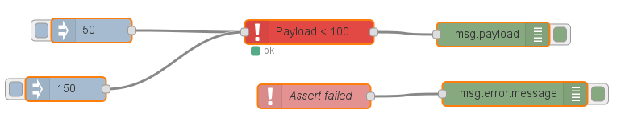

# node-red-contrib-assert
A Node Red node for asserting message properties within a flow.

This node will check all of the specified properties in a message or in the global or flow contexts
to confirm that they meet the required format.

The assert node is configured with a list of rules.  Each rule tests one specific property using either the usual comparison operators, ranges, regex, null, not null, boolean values, or type.  Comparisons can be made against static values, other properties, and the property's previous value.  The specification of the property to be checked is quite powerful, allowing the probing inside objects and arrays using Javascript descriptors.

For a message to pass through the assert node, all tests must pass.  The first failing test is reported as an error which can be caught and processed out of band.  Failed messages are dropped from the flow.

## How to Use

Just insert the Assert node in your flow.  Set the appropriate test conditions to check that the specified properties are valid when a message passes through the Assert node.  Note that you can test global and flow properties as well.  Any message that does not pass the tests will be dropped and an error reported.

The 'is within' test condition has an option to use the mean value of a sliding window of previous values.  When you select 'mean', enter in the size of the window you would like to use.

Here is a sample flow that checks the msg.payload property value is less than 100:



```
[{"id":"ede6fe04.eded3","type":"assert","z":"8b42e25d.61776","name":"Payload < 100",
"rules":[{"property":"payload","propertyType":"msg","type":"lt","value":"100","valueType":"num"}],
"x":442.5,"y":442,"wires":[["4fd55a87.740b74"]]},
{"id":"4fd55a87.740b74","type":"debug","z":"8b42e25d.61776","name":"","active":true,"console":"false",
"complete":"false","x":670.5,"y":445,"wires":[]},{"id":"5f32bb08.e7a17c","type":"inject","z":"8b42e25d.61776",
"name":"","topic":"","payload":"50","payloadType":"num","repeat":"","crontab":"","once":false,"x":172.5,
"y":440,"wires":[["ede6fe04.eded3"]]},{"id":"cb3d81c3.e0ecb8","type":"inject","z":"8b42e25d.61776","name":"","topic":"",
"payload":"150","payloadType":"num","repeat":"","crontab":"","once":false,"x":140.5,"y":513,
"wires":[["ede6fe04.eded3"]]},{"id":"ef019fc4.e98a2","type":"catch","z":"8b42e25d.61776",
"name":"Assert failed","scope":["ede6fe04.eded3"],"x":448.5,"y":522,"wires":[["ff38f898.9fb15"]]},
{"id":"ff38f898.9fb15","type":"debug","z":"8b42e25d.61776","name":"","active":true,"console":"false",
"complete":"error.message","x":697.5,"y":519,"wires":[]}]
```
